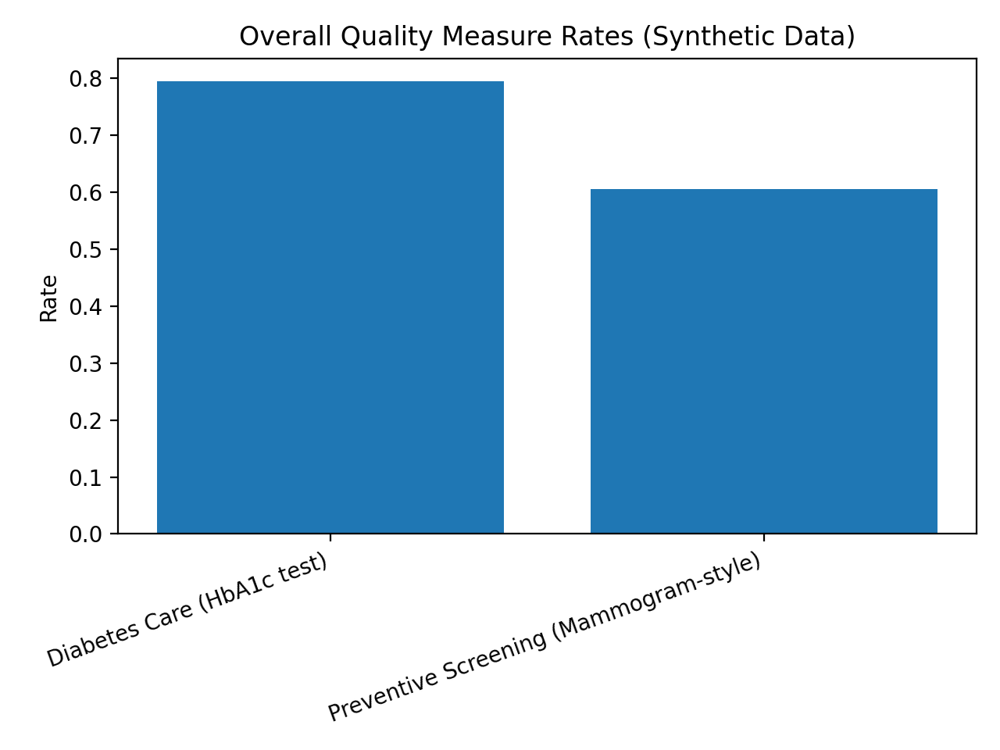
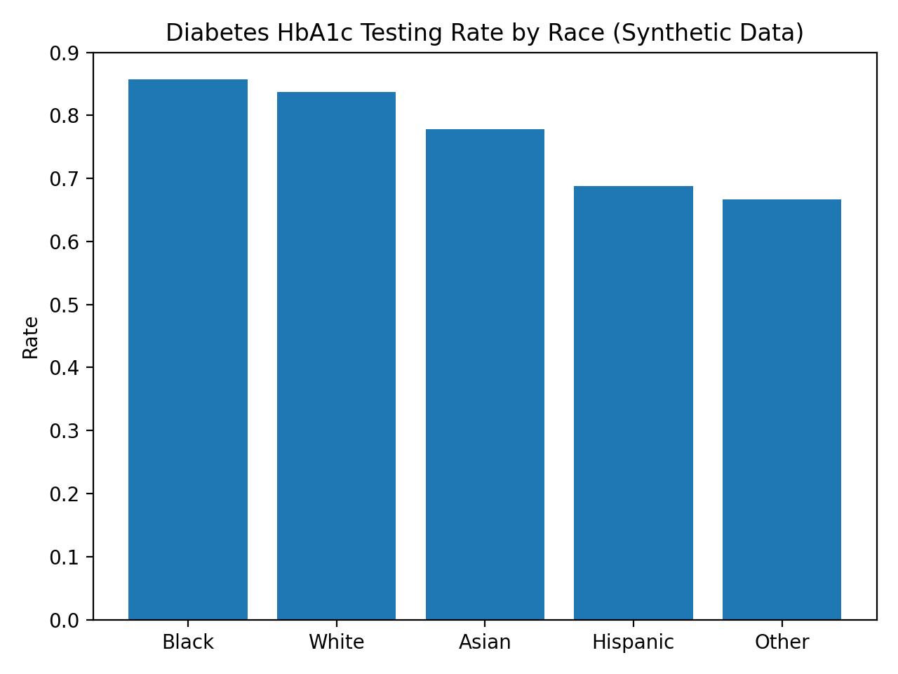

# HEDIS / Stars Quality Analytics (Sample Project — Synthetic Data)

**Quick view (non-technical):**
- 📄 **One-page overview:** `docs/HCQanalyticsWriteUPSQL.pdf`

## What this demonstrates
End-to-end, publication-safe healthcare quality analytics using **synthetic data**:
- HEDIS-style numerator/denominator logic
- SQL ↔ Python cross-validation
- Stratified (equity) reporting
- Audit-minded data validation + clear documentation

> **Data Note:** All data is fully synthetic and safe for public sharing.

---

## Measures modeled (HEDIS-style)
1. **Preventive Screening (Mammogram-style)**
   - Denominator: active female members age 50–74 with a qualifying encounter in the measurement year  
   - Numerator: screening event in a 2-year lookback window

2. **Diabetes Care (HbA1c Testing)**
   - Denominator: active members with diabetes condition flag  
   - Numerator: HbA1c test in the measurement year

---

## Outputs (screenshots)
### Overall performance (rate by measure)

### Stratified results (equity)
  

---

## Validation approach (audit mindset)
Examples of checks included in this workflow:
- Denominator/numerator integrity (no impossible rates; numerator ⩽ denominator)
- Duplicates / missingness checks
- Out-of-range values and date-window enforcement
- Logic parity checks (SQL recompute matches Python outputs)

---

## Tech stack
- **Python:** pandas, matplotlib  
- **SQL:** SQLite (see `queries.sql`)  
- **Notebook:** Jupyter (`healthcare-quality-analytics.ipynb`)

---

## For technical reviewers
- Notebook: `healthcare-quality-analytics.ipynb`
- SQL logic: `queries.sql` (recomputes measures + trends + stratified flags)

## About the author
Kelly Kroeper, MPH, CPH — Healthcare Quality / HEDIS / Stars Analytics
